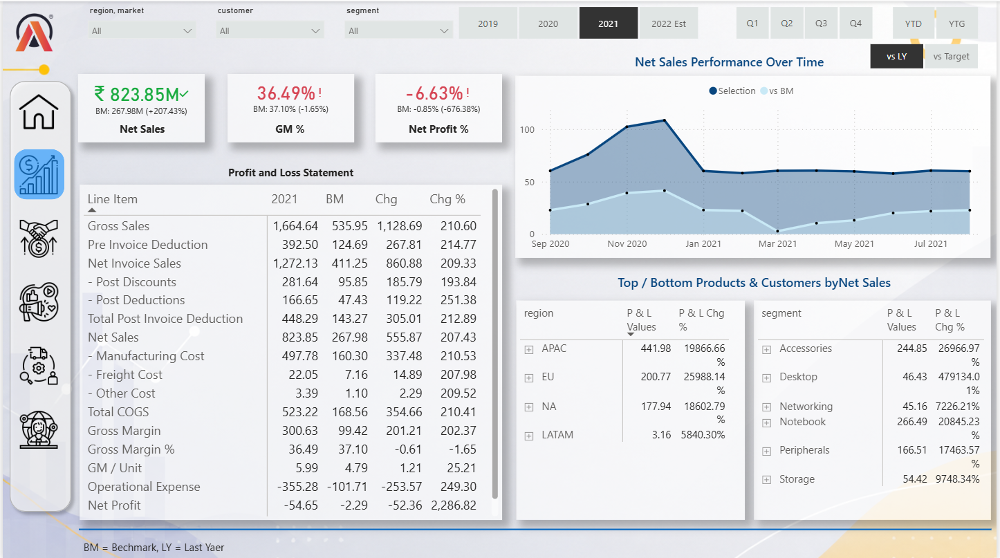
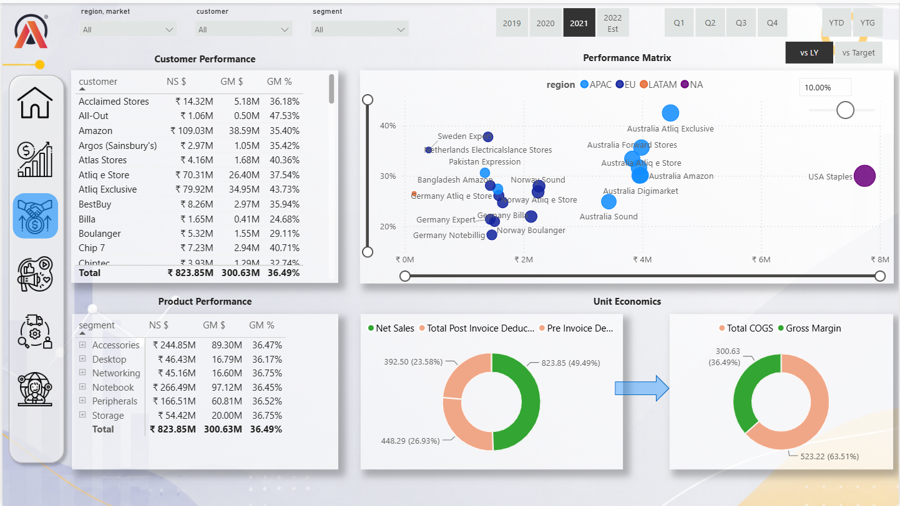
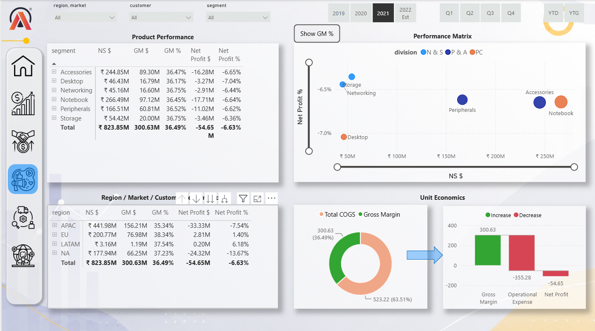
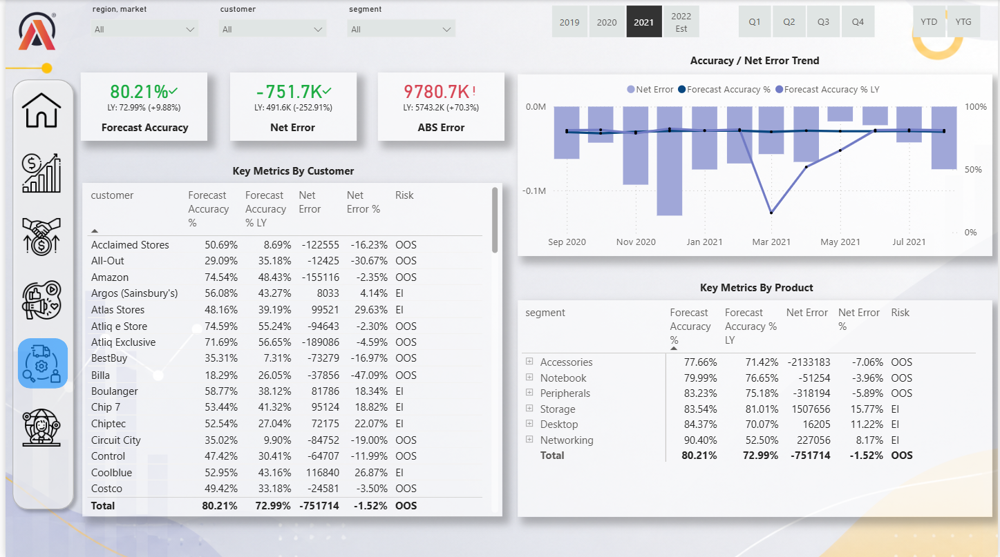
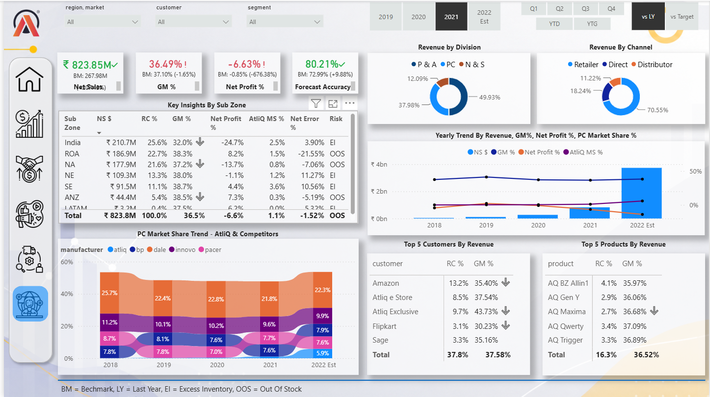
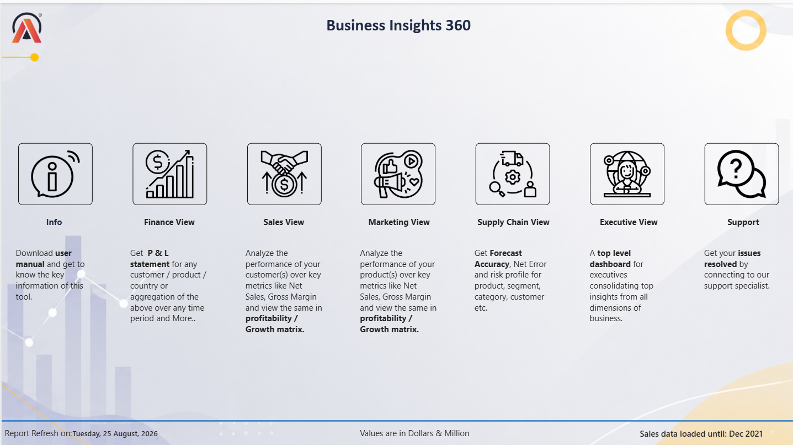

Business Insights 360 — Power BI Dashboard

An interactive Business Intelligence solution for analyzing business performance across Finance, Sales, Marketing, Supply Chain, and Executive functions.

📊 Project Overview

AtliQ Hardware is growing rapidly in the recent years, and they have decided to implement the data analytics using PowerBi in their company for the first time to surpass their competitors in the market and to make data driven decisions. This project is hoped to give answers to the questions of stakeholder in terms all the aspects like finance, sales, marketing and supply chain.

Business Insights 360 is an end-to-end Power BI business intelligence project designed to provide a consolidated view of business performance across multiple functional areas.

The dashboard brings together financial, sales, marketing, supply chain, product, and executive-level analysis into an interactive reporting solution.

The objective is to transform business data into meaningful KPIs, trends, performance comparisons, and actionable insights that can support data-driven decision-making.

I worked on this project by following the Codebasics PowerBi Course, Link to the course is

🎯 Business Problem

Business performance data is often distributed across different functions, making it difficult for stakeholders to obtain a single, consistent view of overall performance.

This project addresses that challenge by providing an interactive Power BI dashboard that enables users to:

Monitor overall business performance

Analyze revenue, gross margin, and profitability

Compare performance across regions, markets, customers, and products

Analyze sales and channel performance

Monitor forecast accuracy and forecast errors

Identify inventory and supply chain risks

Compare performance against previous-year and target benchmarks

Investigate business performance through interactive filters and drill-down analysis

🎯 Project Objectives

Build an interactive business intelligence dashboard

Create a consolidated view of important business KPIs

Analyze performance across multiple business functions

Identify trends, performance gaps, and business risks

Enable interactive filtering and drill-down analysis

Present complex business data through intuitive visualizations

Support data-driven business decision-making

🛠️ Tools & Technologies

Tool / Technology

Purpose

Power BI

Dashboard development and data visualization

Power Query

Data transformation and preparation

DAX

Measures, calculated metrics, and KPI analysis

Data Modeling

Building relationships and analytical data structure

SQL

Data querying and analysis

Excel

Source/practice data used during project development

📑 Report Views

1. Finance View

Provides financial performance analysis using metrics such as:

Net Sales

Gross Margin %

Net Profit %

Revenue trends

Revenue by division

Revenue by channel

Regional / market performance

Customer performance

Product performance

Gross margin and operational expense analysis

The view also supports comparison against benchmarks, previous-year performance, and targets.

2. Sales View

Provides detailed sales performance analysis across:

Customers

Products

Regions / markets

Segments

Sales channels

Revenue trends

Gross margin

Net profit

Interactive filters allow users to investigate sales performance from different business dimensions.

3. Marketing View

Provides analysis of marketing-related business performance and enables stakeholders to evaluate performance across relevant business dimensions.

4. Supply Chain View

Focuses on supply chain and forecast performance.

Key metrics include:

Forecast Accuracy

Net Error

Absolute Error

Forecast Accuracy vs Last Year

Customer-level forecast performance

Product/segment-level forecast performance

Supply chain risk classification

The dashboard identifies risks such as Excess Inventory (EI) and Out of Stock (OOS).

5. Executive View

Provides a high-level summary of overall business performance for management and decision-makers.

It brings together important KPIs and business trends to help executives quickly identify:

Overall performance

Revenue and profitability trends

Major business drivers

Regional performance

Customer and product performance

Market-share trends

Areas requiring attention

6. Product Analysis

The report provides product-level analysis covering:

Net Sales

Gross Margin

Gross Margin %

Net Profit

Net Profit %

Product/segment performance

Performance matrix analysis

7. Support / Information

The report also includes supporting and informational pages to help users navigate and understand the dashboard.

📈 Key KPIs & Metrics

Financial & Sales

Net Sales

Gross Margin

Gross Margin %

Net Profit

Net Profit %

Revenue

Revenue Contribution %

Revenue by Division

Revenue by Channel

Supply Chain

Forecast Accuracy %

Forecast Accuracy % LY

Net Error

Net Error %

Absolute Error

Risk Classification

Business Performance

Market Share %

Customer Performance

Product Performance

Regional / Market Performance

Target vs Actual

Year-over-Year Performance

🔍 Dashboard Analysis

Revenue & Profitability

The dashboard enables users to analyze revenue, gross margin, and net profit trends over time and across different business dimensions.

Customer Analysis

Customer-level analysis helps identify major contributors to revenue and gross margin and allows performance comparison across customers.

Product Analysis

Product-level analysis provides visibility into sales, margins, and profitability and helps identify products requiring further investigation.

Regional & Market Analysis

The dashboard allows performance comparison across regions and markets to identify strong and weak business areas.

Market Share Analysis

Market share trends can be compared across competitors and business periods to understand competitive positioning.

Forecast Analysis

Supply chain analysis evaluates forecast accuracy and forecast errors at customer and product levels, helping identify inventory-related risks.

💡 Business Questions Answered

Which regions contribute the most to revenue?

Which customers generate the highest sales and margins?

Which products contribute significantly to revenue?

Where are profitability issues occurring?

How is market share changing over time?

How does current performance compare with the previous year?

How accurate are forecasts?

Which customers or products have high forecast errors?

Where are excess inventory or out-of-stock risks present?

Which business areas require management attention?

📸 Dashboard Preview

The Resources folder contains visual previews of the Power BI report.

Finance View

Sales View

Marketing View

Supply Chain View

Executive View

Overall Dashboard

Support / Information

📂 Repository Structure

BI-360/
│
├── README.md
│
├── Report/
│   └── business_insights_360.pbix
│
└── Resources/
    ├── Info.gif
    ├── Finance_View.gif
    ├── Sales_View.gif
    ├── Marketing_View.gif
    ├── Supply_Chain_View.gif
    ├── Executive_View.gif
    ├── Products_View.gif
    └── Support_View.gif

Resource filenames can be adjusted to match the files uploaded to the repository.

🧩 Data Availability

This project was developed using practice/educational datasets.

The original Excel/source datasets are not included in this repository because they are not available for redistribution.

The repository therefore focuses on the Power BI report and visual documentation of the analysis.

📁 Power BI Report

The complete Power BI report is located in:

Report/business_insights_360.pbix

Because the Power BI file is approximately 232 MB, it should be managed using Git Large File Storage (Git LFS) rather than regular Git storage.

🚀 Skills Demonstrated

Business Intelligence

Data Analysis

Power BI

Power Query

DAX

Data Modeling

KPI Development

Data Visualization

Financial Analysis

Sales Analysis

Supply Chain Analytics

Forecast Analysis

Business Performance Analysis

SQL

Analytical Thinking

Dashboard Design

🎯 Project Outcome

The final dashboard provides a centralized analytical view of business performance and enables stakeholders to move from high-level KPI monitoring to detailed analysis of customers, products, markets, and supply chain performance.

The solution demonstrates how business data can be transformed into an interactive BI reporting environment that supports data-driven decision-making.

👤 Project

Rahul mirashi

Data Analytics | Business Intelligence | Power BI

Turning Data into Decisions
